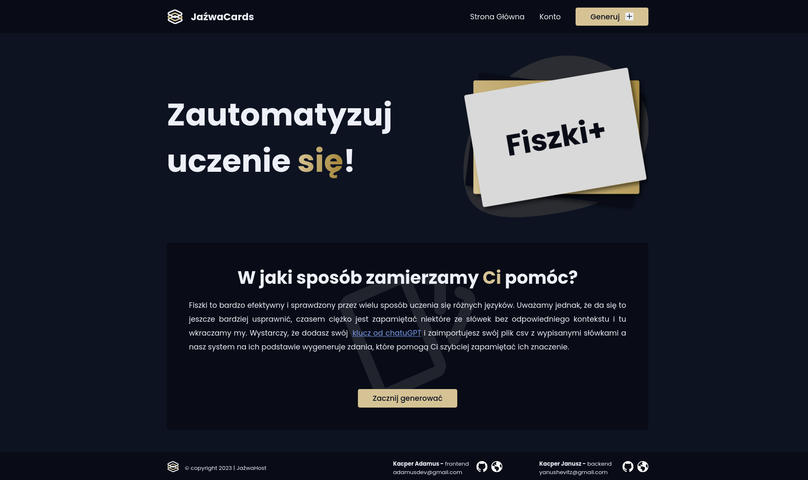

# JaźwaCards Source Code


Automatyzacja uczenia języków z pomocą AI

## Projekt używa bibliotek

- nookies
- openai
- iron-session

## Włączenie servera z projektem

```bash
#Pobranie bibliotek
npm run i

#Odpalenie servera developerskiego
npm run dev
```

Następnie należy wejść pod link [http://localhost:3000](http://localhost:3000)

## Budowa projektu

```bash
#Zbudowanie projektu
npm run build

#Dystrybucja
npm run start
```
